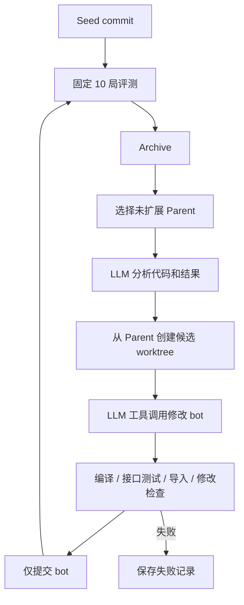

# 架构与数据流

`bot/` 是唯一可进化区域；`rsi/`、提示词、配置和测试属于固定实验框架。

## 模块职责

- `bot.main.SeedBot`：BotAI 生命周期，调用观察、经济、战斗模块；不启动游戏。
- `rsi.agent`、`rsi.llm`：标准助手消息与工具调用消息往返；模型配置从环境读取。Analyzer 用 JSON 输出一个问题和多个候选方向，Improver 每次只实现一个方向。
- `rsi.tools`：受限文本编辑、固定命令、Git 包装。Evolution 控制 worktree 和提交；Agent 不能直接控制版本历史。
- `rsi.evaluation`：主进程调用固定单局 worker，每局独立进程，统一汇总和持久化结果。Bot 导入位于游戏 worker 内，不进入控制进程。
- `rsi.evolution`：Archive 节点、排名、JSON 原子保存。`rsi.loop` 串行组织全部步骤。

## 版本和状态

节点的 `parent_id` 对应搜索血缘，`commit` 对应实际代码版本；`generation` 是树深度，配置的 `max_generations` 是最大扩展轮数。候选 ID 包含时间和随机运行标识，互不冲突。

排名为胜场降序、深度升序、创建顺序升序，任何崩溃都淘汰。每轮从所有未扩展有效节点中取最多 beam_width 个 Parent，先冻结本轮 Parent 列表，再逐一生成 branch_factor 个候选。Parent 完成全部候选尝试后标记 expanded，失败尝试不会无限重试。

每个候选提交前保存 Agent 和 Smoke 记录，提交后先保存节点 commit，再评测。逐局保存结果，整批完成后写入 Archive，逐候选更新状态。生成/测试失败不作为输局进入 Archive；分析结果两次不合法则记录错误并停止实验。异常退出不进行自动恢复。

## 边界

配置在运行开始时复制为 JSON，单局 worker 从固定副本读取。框架没有面向模型的评测参数修改接口。工具只做本地实验范围限制，不能隔离恶意 Python；强安全隔离需后续操作系统沙箱支持。

主入口检查安装、地图和 Git，缺失基础设施立即失败。预检不启动游戏，不能证明 SC2 API 服务一定可启动；通过预检后的进程异常、SC2 错误日志、无效结果和超时按崩溃记录。
